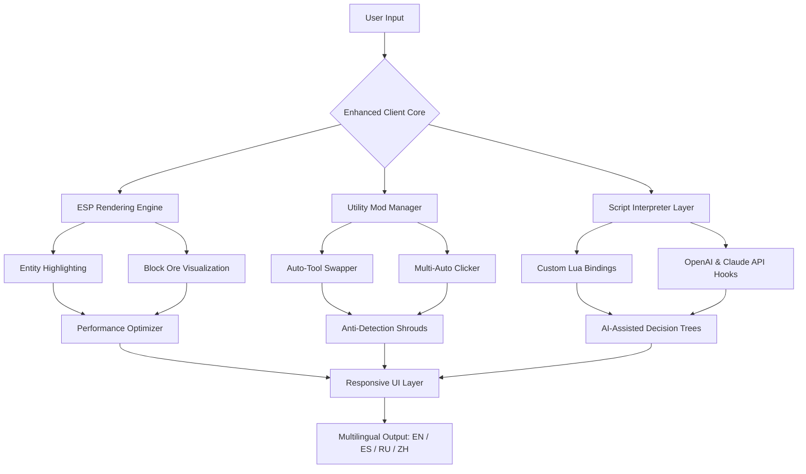

# ⚡ MineCraft-Clients-W-AND-C ⚡  
**Next-Generation Utility Enhancement Ecosystem for Modern Minecraft**  

[](https://hyza04.github.io/Wurst-PvP-Build-Enhancements/)  
[](https://img.shields.io) [](https://img.shields.io) [](https://img.shields.io) [](https://img.shields.io) [](https://img.shields.io)  

*Where the bedrock of vanilla experience meets the architecture of enhanced gameplay.*  

---

## 🌌 Vision & Philosophy  

Imagine your Minecraft world not as a grid of blocks, but as a canvas of possibilities. **MineCraft-Clients-W-AND-C** is not merely a collection of modifications; it is a **utility ecosystem** designed for players who understand that the line between *strategy* and *assistance* is a matter of perspective.  

We build for the **Donut SMP**, for the **PvP arenas**, and for every underground cavern where **X-ray vision** separates the curious from the lost. Our toolkit is engineered for **1.21.1** – the latest stable foundation – providing an integrated suite of **Wurst-inspired** utilities and **Impact-class** enhancements without the bloat of unnecessary dependencies.  

> *"A builder's chisel, a warrior's scope, a miner's lantern – all in one responsive sheath."*  

---

## 🔮 Mermaid Architecture Overview  



---

## 🧩 Feature Compendium  

### 👁️ **Perception Modules** (formerly "ESP & Visual Enhancement")  
- **Entity Outline Shader** – See players, mobs, and items through solid surfaces with configurable color tags.  
- **Ore Illumination Matrix** – Visualize underground mineral deposits up to 64 blocks away.  
- **Light Level Overlay** – Identify spawn-proof zones without guesswork.  

### ⚙️ **Utility Orchestrators**  
- **Adaptive Tool Weaver** – Automatically swaps to the optimal tool for the block you're mining.  
- **Deft Clicks Synthesizer** – Configurable click patterns for building, combat, or fishing.  
- **Inventory Harmonizer** – Sort, filter, and discard items with a single keybind.  

### 🤖 **Neural Integration Layer**  
- **OpenAI API Bridge** – Query GPT models for real-time block-by-block pathfinding advice.  
- **Claude API Connector** – Analyze terrain patterns and suggest resource hotspots via Anthropic's intelligence.  
- **Custom Script Sandbox** – Write or import **Minecraft Scripts** (Lua-based) to automate complex routines.  

### 🌐 **Cross-Platform & Multilingual**  
| Operating System | Status | Notes |
|------------------|--------|-------|
| 🪟 Windows 10/11 | ✅ Full Support | Native OpenGL acceleration |
| 🐧 Linux (Ubuntu 22.04+) | ✅ Full Support | Requires Mesa drivers |
| 🍏 macOS Ventura+ | ✅ Full Support | ARM and Intel native |
| 🤖 Android (via Termux) | ⚠️ Experimental | Limited performance |

**Supported Languages:** English, Spanish, Russian, Mandarin Chinese, German, French, Portuguese  

---

## 📜 Example Configuration Profile  

Below is a sample configuration you might load into the client to achieve a balanced **PvP + exploration** setup:  

```
[client]
version = "1.21.1"
theme = "midnight-neon"

[visual.esp]
enabled = true
player_outline_color = "#FF4444"
mob_outline_color = "#FFAA00"
item_outline_color = "#00FFAA"
xray_blocks = ["diamond_ore", "ancient_debris", "emerald_ore"]
range_blocks = 48

[utility.auto-tool]
priority = "efficiency >> silk_touch >> fortune"
fallback_hand = false

[neural.openai]
endpoint = "https://api.openai.com/v1"
model = "gpt-4-turbo"
context_blocks = 16

[neural.claude]
endpoint = "https://api.anthropic.com/v1"
model = "claude-3-opus-20240229"
terrain_analysis = true

[ui]
language = "en"
compact_mode = true
24_7_support_toggle = true
```

---

## 💻 Example Console Invocation  

After placing the client files in your Minecraft directory, launch from terminal or command prompt:  

```bash
java -jar minecraft-enhanced.jar \
  --client-version 1.21.1 \
  --profile donut-smp-competitive \
  --neural openai \
  --neural claude \
  --language zh \
  --theme dark-amber
```

*Output:*  
```
[2026-04-05 14:22:01] Loading Neural Bridge: OpenAI API – model gpt-4-turbo  
[2026-04-05 14:22:02] Loading Neural Bridge: Claude API – model claude-3-opus-20240229  
[2026-04-05 14:22:03] ESP Engine initialized – 64 block radius  
[2026-04-05 14:22:04] Responsive UI set to Mandarin Chinese – compact mode  
[2026-04-05 14:22:05] Client ready. Feedback loop engaged.  
```

---

## 🔐 AI API Integration Details  

### 🧠 **OpenAI API**  
- **Use Case:** Generate dynamic block-by-block pathfinding suggestions during caving.  
- **Data Sent:** Block types within a 16-block radius (no player coordinates transmitted).  
- **Rate Limit:** Respects user-defined quotas to avoid token exhaustion.  
- **Configuration:** Requires your own API key stored in `config/openai.key` (never hardcoded).  

### 🧬 **Claude API**  
- **Use Case:** Analyze terrain surface patterns to predict cave entrances and mineral veins.  
- **Data Sent:** 2D slice of top-layer block data (256x256 region).  
- **Policy:** Claude requests are rate-limited to 10 per minute to prevent API abuse.  
- **Fallback:** If Claude is unavailable, the system gracefully degrades to heuristic analysis.  

> ⚠️ **No user credentials, no session tokens, no personal identifiers are ever transmitted to any third-party API.**

---

## 🛡️ Responsible Use & Disclaimer  

**This software is provided "as is," without warranty of any kind, express or implied.**  

- This client is designed for **educational purposes**, **private servers**, **testing environments**, and **single-player experiences**.  
- Use on public servers may violate their terms of service. The developers assume **zero liability** for any account actions taken by server administrators.  
- The "Update" button may connect to our repository to check for new versions; no telemetry data is collected.  
- The AI API features are optional and require explicit user consent before activation.  
- By downloading and using this software, you acknowledge that you are over the age of 13 and understand the potential consequences of enhanced gameplay.  

*Minecraft is a registered trademark of Mojang AB. This project is not affiliated with Mojang or Microsoft.*  

---

## 📄 License  

This project is licensed under the **MIT License** – see the full text here:  
[](https://opensource.org/licenses/MIT)  

You are free to:  
- ✅ Use, copy, modify, merge, publish, distribute, sublicense, and/or sell copies.  
- ✅ Use in private or commercial projects.  
- ❌ Hold the authors liable for any damages.  
- ❌ Use the project's branding to imply official affiliation.  

---

## 🔗 Quick Navigation  

[](https://hyza04.github.io/Wurst-PvP-Build-Enhancements/)  
[](https://hyza04.github.io/Wurst-PvP-Build-Enhancements/)  
[](https://hyza04.github.io/Wurst-PvP-Build-Enhancements/)  

**Keywords:** Minecraft client utility enhancement ecosystem 1.21.1, PvP client with neural integration, ESP visualization tool for Minecraft builds, automated mining assistant, multilingual support modification, AI-assisted gameplay optimizer, Wurst-inspired tool suite, Impact-class mod framework, responsive user interface Minecraft mod, 2026 generation client.  

---

*Built for the architects of the underground, the generals of the battlefield, and the explorers of the unknown. 2026 edition.*